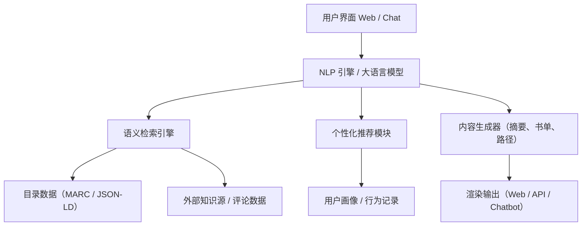

# 📚 BibSight: 基于生成式人工智能的下一代书目系统

**BibSight** 是一个开源的、由生成式人工智能（Generative AI）驱动的智能书目发现系统，致力于突破传统 OPAC 的技术边界，打造真正理解语义、支持对话、能够生成内容的图书馆知识服务平台。

---

## 🔍 项目动因

长期以来，图书馆的 OPAC（Online Public Access Catalog）系统虽然在信息检索方面发挥了核心作用，但始终存在以下展现性问题：

* 依赖字段匹配与布尔逻辑，缺乏语义理解能力；
* 用户必须学习复杂的检索表达方式，交互体验差；
* 难以支持探索式、跨主题、个性化的知识获取需求。

即使是 VuFind 等“下一代 OPAC”系统，在 UI 界面、资源整合和推荐算法方面取得了一定进展，但其底层仍依赖关键词驱动的检索范式，无法真正构建人与知识之间的语义途径，难以支撑以自然语言提问、语义导航、动态生成内容为特征的新型服务需求。

---

## ✨ 新范式：GPAC 模型

为解决上述问题，BibSight 提出并遵循一种全新的第三代书目系统架构：**GPAC（Generative Public Access Catalog）**，即“生成式联机公共目录系统”。

在 GPAC 模型下：

* 用户以自然语言提出复杂信息需求，系统能理解上下文语义；
* 结合大语言模型（LLM）与知识图谱进行语义检索与推理；
* 实现多轮对话、阅读路径生成、摘要生成、书单策划等功能；
* 以“理解-生成-服务”为核心，构建智能化、人性化、动态化的知识发现体验。

---

## 🌟 书目系统代际模型对比

| 代际  | 系统               | 关键技术                | 用户交互         | 核心能力         |
| --- | ---------------- | ------------------- | ------------ | ------------ |
| 第一代 | OPAC             | 字段匹配 + 布尔逻辑         | 表单检索         | 基础目录查询       |
| 第二代 | VuFind 等推展型 OPAC | Solr/资源分面检索         | 用户签评、分面筛选    | 多源整合 + UI 体验 |
| 第三代 | GPAC             | 大语言模型 + 知识图谱 + 向量检索 | 自然语言对话、个性化推荐 | 语义理解 + 生成式服务 |

---

## 🌟 项目目标

* 🧠 打造一个具备语义理解与生成能力的智能图书发现平台；
* 💬 支持对话式查询与多轮交互，模拟 AI 馆员服务体验；
* 📚 自动生成书单、摘要与阅读路径，服务教育、科研与个性阅读；
* 🧪 提供一个开放、可抽象、可扩展的研究与开发平台，支持 AI 与图情融合创新。

---

## 🧍 核心功能

* 🌐 **自然语言检索**：用口语化问题查询图书，无需掌握字段语法。
* 🔍 **语义增强检索**：结合 LLM 与向量索引，实现深层语义匹配。
* 💬 **多轮对话交互**：支持澄清式提问、上下文保持与交互式探索。
* 📖 **章节级语义建模**：自动生成章节摘要、主题标签、语义索引。
* 📚 **个性化书目推荐**：基于用户画像与任务目标智能推荐书籍。
* 📝 **生成式书单与摘要**：根据主题、课程、场景生成高质量知识内容。
* 🔗 **多源信息整合**：融合 MARC、JSON-LD、评论数据、知识图谱等异构资源。

---

## 🧱 系统架构预览

---

## 📖 应用示例

* 学生提问：“有没有适合中学生学习人工智能的入门书？”
* 教师需求：“请帮我生成一份‘儿童美育’主题的分龄阅读书单。”
* 研究者探索：“列出从 OPAC 到 GPAC 演进的核心参考书目。”
* 家长想知道：“适合8岁孩子阅读的图画书有哪些？”
* 馆员使用：“根据豆瓣评论趋势，生成当前季度借阅热点推荐。”
* AI系统自发服务：“发现用户近期频繁检索某主题，自动推送对应阅读路径与多模态内容。”
